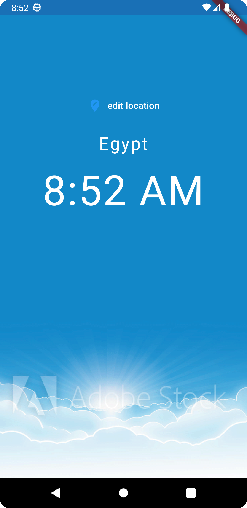
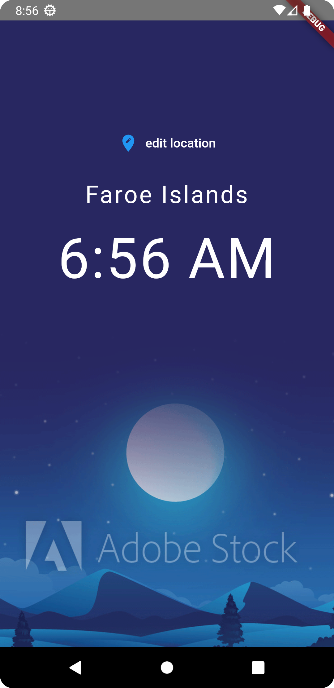
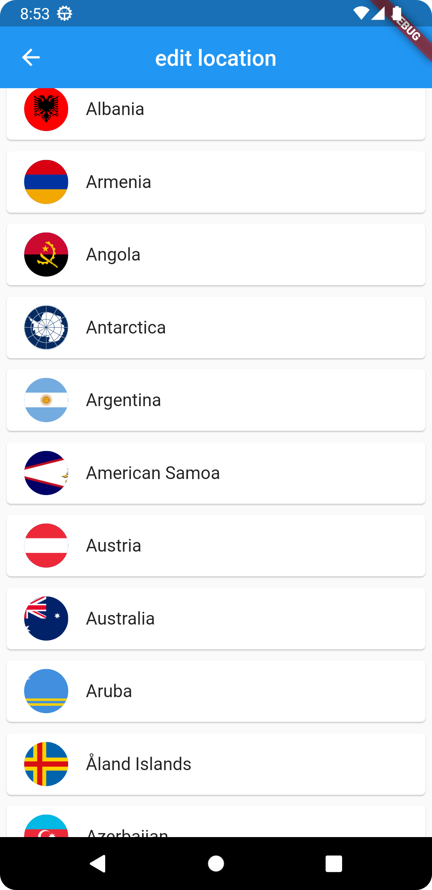

# world_app

A new Flutter project.

## Getting Started

This project is a starting point for a Flutter application  to get time anywhere in the world.

# TimeSync Pro

Introducing **TimeSync Pro**, your ultimate companion for global timekeeping on the go. This sleek Android app effortlessly brings the world's time zones to your fingertips, ensuring you stay connected and punctual across borders.

## Key Features

1. **World Clock at a Glance:**
    - TimeSync Pro presents an intuitive world map interface, allowing you to effortlessly explore and select any location globally. Instantly view the current time, date, and time zone information for your chosen destination.

2. **Personalized Time Zone Library:**
    - Customize your app by adding and organizing your frequently visited or preferred locations. Whether it's tracking business hours or staying connected with loved ones abroad, TimeSync Pro adapts to your global lifestyle.

3. **Day/Night Visualization:**
    - Stay in tune with the rhythm of day and night. TimeSync Pro features a dynamic day/night visualization, providing a quick snapshot of the current daylight status for each location.

4. **Meeting Scheduler:**
    - Plan meetings effortlessly across time zones with the built-in meeting scheduler. Simply select the participating cities, and the app will calculate the most suitable time for everyone involved.

5. **Offline Mode:**
    - Traveling without a data connection? No problem! TimeSync Pro allows you to pre-load time zone data for offline use, ensuring you're always on time, regardless of your internet connection.

6. **Minimalist Design, Maximum Functionality:**
    - Enjoy a clean and modern user interface that prioritizes ease of use. TimeSync Pro is designed for quick access to the information you need without unnecessary clutter.

Whether you're a frequent traveler, a global business professional, or simply curious about the time around the world, TimeSync Pro is the app that keeps you in sync with the pulse of the planet. Download now and unlock the convenience of global timekeeping!

## Instruction to get the app source code

- make sure you have flutter set up in machine
- you can use android studio or vs code
- finally import the project

## App Design
The app has three screens that is home screen, select location screen and the loading screen
The first screen is the day time screen, the second is night time screen and the last one is the 
choose location screen

TimeSync Pro redefines the way we engage with time in our interconnected world. Seamlessly bridging geographical gaps, this app empowers users with the ability to navigate time zones effortlessly, schedule meetings with precision, and stay attuned to the global pulse. Its intuitive design, coupled with powerful features, caters to the needs of jet-setting professionals, globe-trotting adventurers, and anyone with an appreciation for the diverse rhythms of our planet.